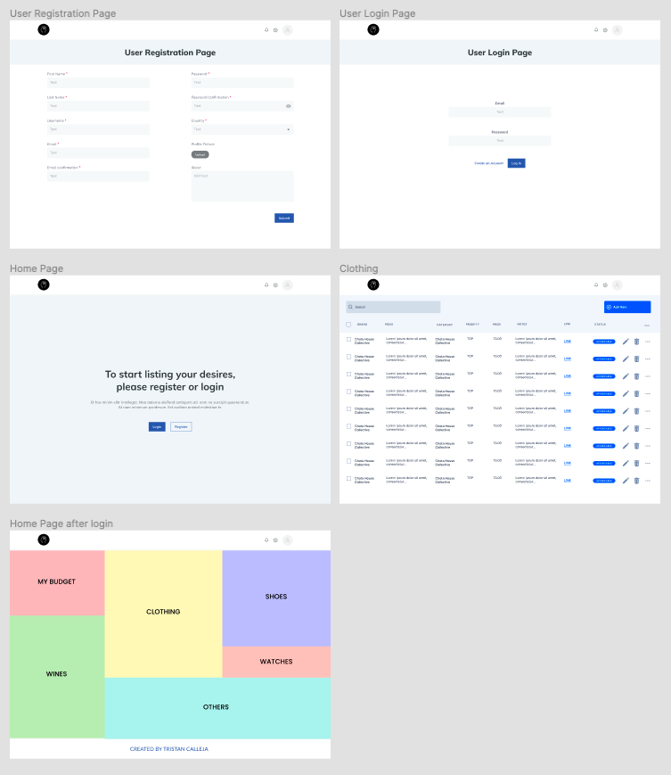
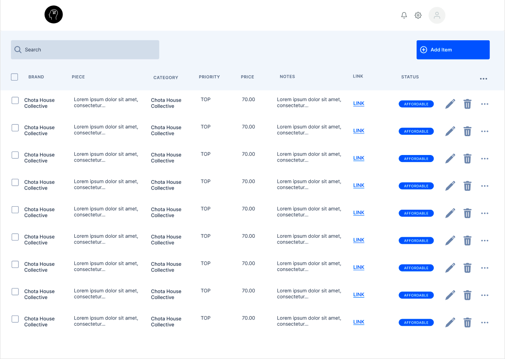

## SEI-23 Project 4 – Materia-List

https://materia-list.herokuapp.com/

### Pitch
We live in a consumerist society. Most of us consume way more than we should and that's especially true when it comes to things like clothing, electronics, etc.
We get targeted by ads all the time and it’s hard to resist temptation often. in the bus, on instagram, on the side of your browser, in your mailbox, etc.
Here comes the <strong>Materia-List</strong>.

Our goal is to help you keep track of the things you really want.
A new envy? List it in <strong>Materia-List</strong>! 
Once you have a budget, look through your list and see what you could do with your money.

Buy Less, Buy Better.

### Wireframes
<!-- ERD:

 -->

##### Below, an overview of the app as first conceptualized.

##### Below, the wireframe of how the main table has been imagined at first.

### MVP
- User authentication
- User profile
- CRUD for entries in clothing
- Online DB storage and deployment

### Further
- Search/Filter through table.
- More routes and models for other lists.
- More features in tables (define categories, price as something else than a string, etc.).
- Give the user a budget that he can adjust and link to other models.
- Random suggestions through databases.
- Alerts for price drops.

### Approach & Process
- Entity Relationship Diagram (ERD) for database relationships
- Wireframes for draft user interface and experience
- Trello for project management 
- One route, one model, basic front-end, repeat
- Deploy and populate database on Heroku

### Technologies used
- NodeJs
- MongoDB
- React
- HTML, CSS
- Bootstrap

### Final Words
Work in progress...